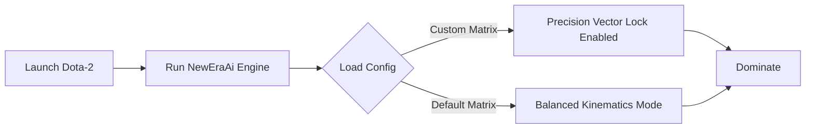

# CollapseX
# Dota2AssistNewEraAICollapseX — Advanced AI Training Platform & Vision Assistant

  <!-- Кликабельные кнопки (Оранжевый индустриальный стиль) -->
  
  

<!-- ПЛЕЙСХОЛДЕР ДЛЯ ВАШЕГО СКРИНШОТА ИНТЕРФЕЙСА -->

## ⚙️ Workflow Diagram

## 1. Dynamic Model Recognition (Visual Assistance)
Instead of interacting with game memory (Internal), the engine uses an External Pixel-Analysis Pipeline to identify distinct geometric shapes, character player models (Skins), and build structures unique to Fortnite's art style.

Low-Latency Input Alignment Vector (Dynamic Tracking) Calculates the spatial discrepancy between the user's current camera vector and the detected target matrix. * **Humanized Smoothing:** Uses advanced Bezier curve interpolation to prevent robotic movements, emulating organic human input. * **FOV (Field of View) Zoning:** Allows users to define a strict pixel radius ($R_{fov}$) for tracking activation to prevent erratic shifts during rapid build-fights.

## 2. Tactical Spatial Overlay (Augmented Reality HUD)
Renders a lightweight, transparent vector overlay directly onto the Windows Desktop Window Manager (DWM).

Entity Telemetry: Displays bounding frames around detected player models.
Weapon Bloom & Recoil Compensation Assistance: Provides static visual reference points to assist players in managing weapon spread patterns during bloom-heavy Fortnite gunplay.

## 3. AI Core Calibration 
The software relies exclusively on Windows Desktop API pixel capture. It does not open game handles, read runtime memory lines, or hook execution engine functions.

  
  
  

---

## Non-Invasive Safety & Zero-Ban Architecture

* **`[ZERO PROCESS INTERACTION]`** — The software relies exclusively on Windows Desktop API pixel capture. It does not open game handles, read runtime memory lines, or hook execution engine functions.
* **`[ANTI-HEURISTIC PASSIVE]`** — Completely bypasses client-side telemetry systems. Because no code is injected into the application environment, the software cannot be detected by traditional system signature scanners.
* **`[LOCAL HARDWARE COMPILATION]`** — The neural network trains, loads, and operates strictly on your local GPU (CUDA/DirectX), keeping your usage data private and completely decentralized.
* **`[OPTIMIZED YOLO FRAMEWORK]`** — Employs custom micro-architectures that deliver lightning-fast inference times (<2ms) without reducing your active in-game frame rate (FPS).

---

## ⚙️ System Deployment Controls

1. **Download the Core:** Retrieve the compiled AI assistant framework package from the releases section above.
2. **Extraction:** Unpack the compressed archive structure into your preferred workspace directory via *7-Zip* or *WinRAR*.
3. **Model Calibration:** Launch the executive runtime engine as Administrator to initialize the neural network weights, configuration matrices, and GPU hardware acceleration.
4. **Environment Boot:** Start your survival simulation game client and set your video display mode to *Borderless Windowed*.
5. **Real-Time Tuning:** Use the stream-safe overlay configuration menu (default hotkey: `Insert`) to instantly adjust recognition confidence thresholds, detection zones, and humanized smoothing filters.

---

## Tactical Application Profiles

* **Reflex Skill Building:** Sharpen your holding angles, recoil control patterns, and flick mechanics against fast-moving targets under simulated high-pressure combat scenarios.
* **Competitive Training:** Maintain optimal crosshair placement, bullet drop compensation, and active target tracking during intense close-quarters encounters or base defense phases.
* **Stream-Safe Performance:** Stream or capture your gameplay seamlessly — the AI overlay operates on an independent desktop rendering layer hidden from capturing software like OBS and Discord.

---

`gameplay-analysis`, `fortnite-2026`, `yolov8`, `automation`, `automation-framework`, `real-time-processing`, `computer-vision`, `object-detection`

<!-- update: A -->
